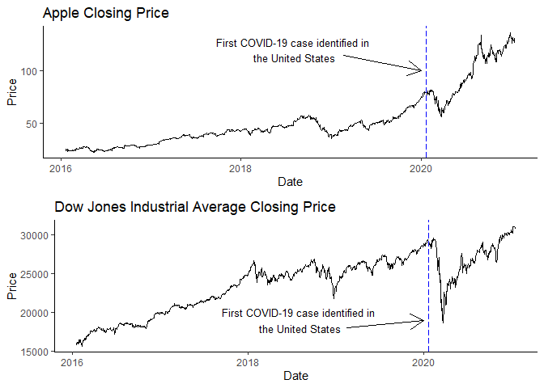
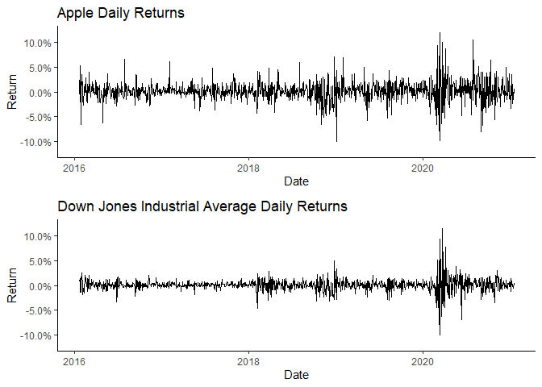
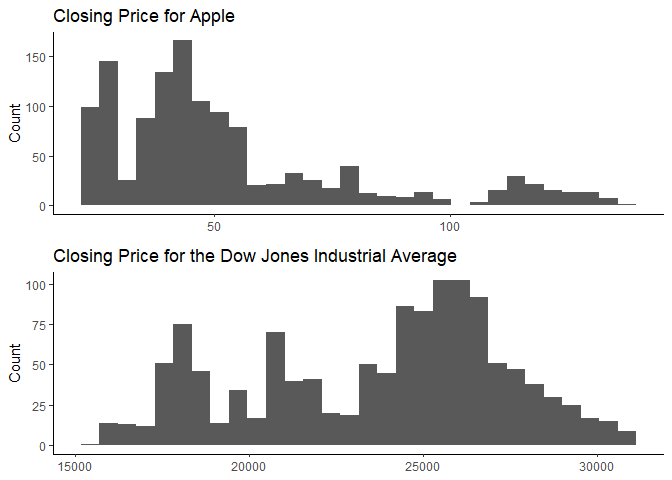
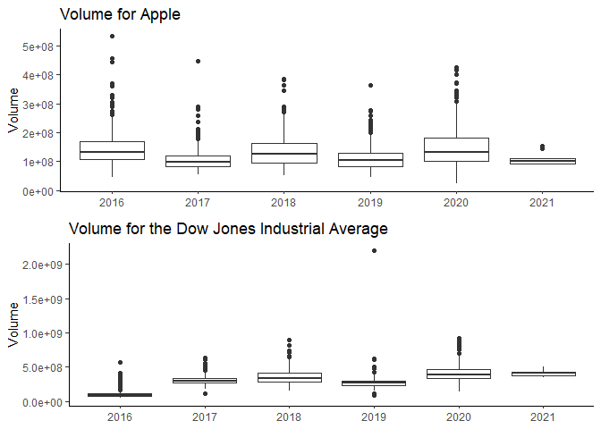
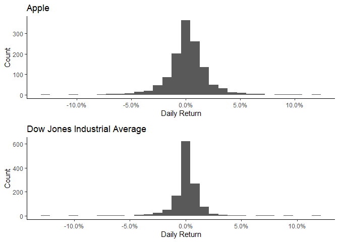
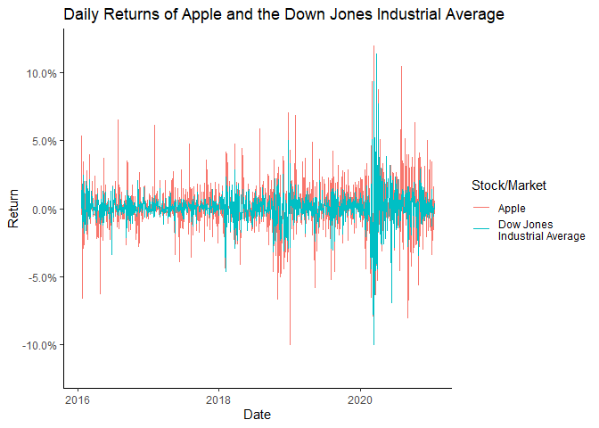
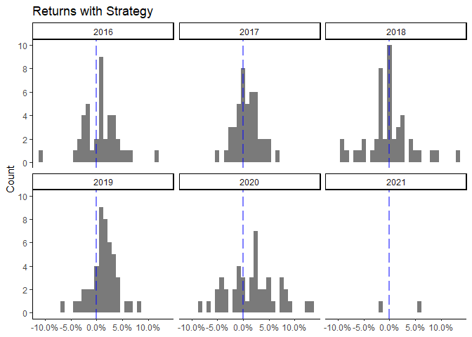
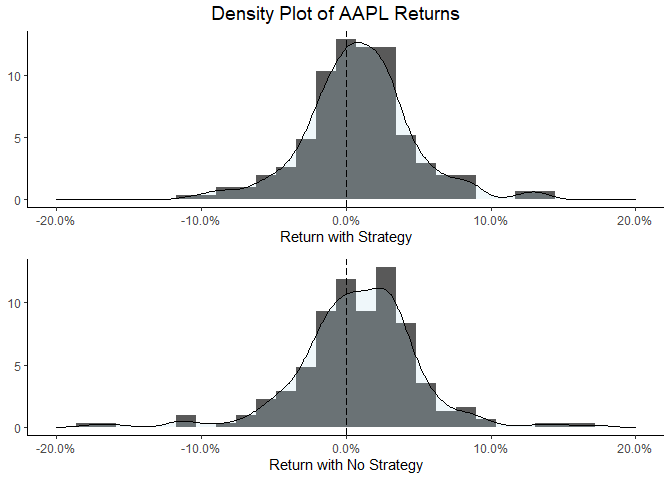

Project 1
================
Matt B
1/20/2021

## Load Packages

``` r
# uncomment line to install pacman
# install.packages("pacman")
pacman::p_load(tidyverse, gridExtra, lubridate, kableExtra)
theme_set(theme_classic())
```

## Load and Explore Data

Data is 5 year historical daily data for
[AAPL](https://finance.yahoo.com/quote/AAPL/history?period1=1453248000&period2=1611100800&interval=1d&filter=history&frequency=1d&includeAdjustedClose=true)
and 5 year daily historical data for the [Dow Jones Industrial
Average](https://finance.yahoo.com/quote/%5EDJI/history?period1=1453248000&period2=1611100800&interval=1d&filter=history&frequency=1d&includeAdjustedClose=true).

``` r
aapl <- read_csv("AApl.csv")
```

    ## Rows: 1259 Columns: 7

    ## -- Column specification --------------------------------------------------------
    ## Delimiter: ","
    ## dbl  (6): Open, High, Low, Close, Adj Close, Volume
    ## date (1): Date

    ## 
    ## i Use `spec()` to retrieve the full column specification for this data.
    ## i Specify the column types or set `show_col_types = FALSE` to quiet this message.

``` r
dji <- read_csv("^DJI.csv")
```

    ## Rows: 1259 Columns: 7

    ## -- Column specification --------------------------------------------------------
    ## Delimiter: ","
    ## dbl  (6): Open, High, Low, Close, Adj Close, Volume
    ## date (1): Date

    ## 
    ## i Use `spec()` to retrieve the full column specification for this data.
    ## i Specify the column types or set `show_col_types = FALSE` to quiet this message.

``` r
grid.arrange(
  ggplot(aapl, aes(x = Date, y = Close)) +
    geom_line() +
    labs(title = "Apple Closing Price", y = "Price") +
    geom_vline(xintercept = as.numeric(as.Date("2020-01-21")), linetype = 5, color = "blue") +
    annotate(geom = "text", x = as.Date("2018-8-09"), label = "First COVID-19 case identified in \nthe United States",
                  y = 120, size = 3.5) +
    geom_segment(aes(x = as.Date("2019-2-20"), y = 115, xend = as.Date("2020-01-01"), yend = 100), 
                 arrow = arrow(length = unit(0.5, "cm"))),
  ggplot(dji, aes(x = Date, y = Close)) +
    geom_line() +
    labs(title = "Dow Jones Industrial Average Closing Price", y = "Price") +
    geom_vline(xintercept = as.numeric(as.Date("2020-01-21")), linetype = 5, color = "blue") +
    annotate(geom = "text", x = as.Date("2018-8-09"), label = "First COVID-19 case identified in \nthe United States",
                  y = 19000, size = 3.5) +
    geom_segment(aes(x = as.Date("2019-2-15"), y = 18050, xend = as.Date("2020-01-01"), yend = 19000), 
                 arrow = arrow(length = unit(0.5, "cm"))),
  nrow = 2
)
```

<!-- -->

``` r
grid.arrange(
  ggplot(aapl, aes(x = Date, y = (Close/lag(Close)) - 1)) +
    geom_line() +
    labs(title = "Apple Daily Returns", y = "Return") +
    scale_y_continuous(labels = scales::percent, limits = c(-.12, .12)),
  ggplot(dji, aes(x = Date, y = (Close/lag(Close)) - 1)) +
    geom_line() +
    labs(title = "Down Jones Industrial Average Daily Returns", y = "Return") +
    scale_y_continuous(labels = scales::percent, limits = c(-.12, .12)),
  nrow = 2
)
```

    ## Warning: Removed 1 row(s) containing missing values (geom_path).

    ## Warning: Removed 1 row(s) containing missing values (geom_path).

<!-- -->

``` r
grid.arrange(
  ggplot(aapl, aes(x = Close)) +
    geom_histogram() +
    labs(title = "Closing Price for Apple", x = NULL, y = "Count"),
  ggplot(dji, aes(x = Close)) +
    geom_histogram() +
    labs(title = "Closing Price for the Dow Jones Industrial Average", x = NULL, y = "Count"),
  nrow = 2
)
```

    ## `stat_bin()` using `bins = 30`. Pick better value with `binwidth`.
    ## `stat_bin()` using `bins = 30`. Pick better value with `binwidth`.

<!-- -->

``` r
grid.arrange(
  ggplot(aapl, aes(x = factor(year(Date)), y = Volume, group = factor(year(Date)))) +
    geom_boxplot() +
    labs(title = "Volume for Apple", x = NULL, y = "Volume"),
  ggplot(dji, aes(x = factor(year(Date)), y = Volume, group = factor(year(Date)))) +
    geom_boxplot() +
    labs(title = "Volume for the Dow Jones Industrial Average", x = NULL, y = "Volume"),
  nrow = 2
)
```

<!-- -->

``` r
# Calculate daily return for both AAPL and DJI
aapl <- aapl %>% 
  mutate(daily_return = (Close/lag(Close)) - 1)
dji <- dji %>% 
  mutate(daily_return = (Close/lag(Close)) - 1)
```

``` r
grid.arrange(
  ggplot(aapl, aes(x = daily_return)) +
    geom_histogram() +
    labs(title = "Apple", y = "Count", x = "Daily Return") +
    scale_x_continuous(labels = scales::percent),
  ggplot(dji, aes(x = daily_return)) +
    geom_histogram() +
    labs(title = "Dow Jones Industrial Average", y = "Count", x = "Daily Return") +
    scale_x_continuous(labels = scales::percent),
  nrow = 2
)
```

    ## `stat_bin()` using `bins = 30`. Pick better value with `binwidth`.

    ## Warning: Removed 1 rows containing non-finite values (stat_bin).

    ## `stat_bin()` using `bins = 30`. Pick better value with `binwidth`.

    ## Warning: Removed 1 rows containing non-finite values (stat_bin).

<!-- -->

``` r
summary(aapl$daily_return)
```

    ##      Min.   1st Qu.    Median      Mean   3rd Qu.      Max.      NA's 
    ## -0.128647 -0.006023  0.001001  0.001505  0.010099  0.119808         1

``` r
summary(dji$daily_return)
```

    ##       Min.    1st Qu.     Median       Mean    3rd Qu.       Max.       NA's 
    ## -0.1292655 -0.0030436  0.0008881  0.0006160  0.0052456  0.1136504          1

``` r
cor(aapl$daily_return, dji$daily_return, use = "complete.obs")
```

    ## [1] 0.698289

``` r
aapl %>% 
  mutate(Type = "aapl") %>% 
  bind_rows(dji %>% 
              mutate(Type = "dji")) %>% 
  ggplot(aes(x = Date, y = daily_return, color = Type)) +
    geom_line() +
    labs(title = "Daily Returns of Apple and the Down Jones Industrial Average", y = "Return",
         color = "Stock/Market") +
    scale_y_continuous(labels = scales::percent, limits = c(-.12, .12)) + 
    scale_color_hue(labels = c("Apple", "Dow Jones \nIndustrial Average"))
```

    ## Warning: Removed 2 row(s) containing missing values (geom_path).

<!-- -->

## Implement Trading Strategy

``` r
aapl_mon_fri <- aapl %>% 
  mutate(weekday = as.character(wday(Date, label = TRUE))) %>% 
  filter(weekday == "Mon" | weekday == "Fri")
```

``` r
aapl_mon_fri <- aapl_mon_fri %>% 
  filter(lag(weekday) != weekday & Date > "2016-01-22")
```

``` r
aapl_mon_fri$investment_return_strategy <- 0
aapl_mon_fri$holding <- 0
aapl_mon_fri$decision <- NA
n = nrow(aapl_mon_fri)

for (i in 1:n) {
  day_of_week <- aapl_mon_fri$weekday[i]
  
  #signals
  if (day_of_week == "Mon") {
    decision = "Buy"
  }
  else if (day_of_week == "Fri") {
    decision = "Sell"
  }
  
  
  # holding status
  if (decision == "Sell") {
    holding = 0
  }
  else if (decision == "Buy") {
    holding = 1
  }
  
  # calculate investment return
  if (day_of_week == "Mon") {
    investment_return_strategy = 0
  }
  else if (day_of_week == "Fri") {
    investment_return_strategy = aapl_mon_fri$Close[i] / aapl_mon_fri$Open[i - 1] - 1
  }
  
  aapl_mon_fri$investment_return_strategy[i] <- investment_return_strategy
  aapl_mon_fri$holding[i] <- holding
  aapl_mon_fri$decision[i] <- decision
}
```

## Evaluate Trading Strategy

``` r
return_data <- aapl_mon_fri %>% 
  filter(weekday == "Fri") %>% 
  mutate(no_losses_strategy = ifelse(investment_return_strategy >= 0, "No Loss", "Loss"))
```

``` r
return_data <- return_data %>% 
  mutate(investment_return_no_strategy = Close/lag(Close) - 1) %>% 
  filter(!is.na(investment_return_no_strategy)) %>% 
  mutate(no_losses_default_strategy = ifelse(investment_return_no_strategy >= 0, "No Loss", "Loss"))
```

``` r
dji <- dji %>% 
  semi_join(return_data, by = "Date") %>% 
  mutate(investment_return_no_strategy = Close/lag(Close) - 1) %>% 
  mutate(no_losses_default_strategy = ifelse(investment_return_no_strategy >= 0, "No Loss", "Loss")) %>% 
  filter(!is.na(investment_return_no_strategy))
```

``` r
return_data <- return_data %>% 
  filter(Date >= "2016-02-12")
```

### Percentage of weeks lost or gained money

``` r
table_percentage <- function(x) {
  tbl <- table(x)
  prop_table <- cbind(tbl, round(prop.table(tbl) * 100, 2))
  colnames(prop_table) <- c("Count", "Percentage")
  prop_table
}

print("Decision Percentage")
```

    ## [1] "Decision Percentage"

``` r
table_percentage(aapl_mon_fri$decision)
```

    ##      Count Percentage
    ## Buy    228         50
    ## Sell   228         50

``` r
print("Losses Using Strategy (AAPL)")
```

    ## [1] "Losses Using Strategy (AAPL)"

``` r
table_percentage(return_data$no_losses_strategy) 
```

    ##         Count Percentage
    ## Loss       87       38.5
    ## No Loss   139       61.5

``` r
print("Losses Using No Strategy (AAPL)")
```

    ## [1] "Losses Using No Strategy (AAPL)"

``` r
table_percentage(return_data$no_losses_default_strategy)
```

    ##         Count Percentage
    ## Loss       86      38.05
    ## No Loss   140      61.95

``` r
print("Losses Using No Strategy (DJI)")
```

    ## [1] "Losses Using No Strategy (DJI)"

``` r
table_percentage(dji$no_losses_default_strategy)
```

    ##         Count Percentage
    ## Loss       92      40.71
    ## No Loss   134      59.29

### Returns compared to no strategy and market

``` r
# return with strategy (AAPL)
return_data %>% 
  summarise(mean_of_investment_return_strategy = mean(investment_return_strategy),
            sd_of_investment_return_strategy = sd(investment_return_strategy))
```

    ## # A tibble: 1 x 2
    ##   mean_of_investment_return_strategy sd_of_investment_return_strategy
    ##                                <dbl>                            <dbl>
    ## 1                            0.00927                           0.0375

``` r
return_data$investment_return_strategy %>% 
  t.test()
```

    ## 
    ##  One Sample t-test
    ## 
    ## data:  .
    ## t = 3.7194, df = 225, p-value = 0.0002522
    ## alternative hypothesis: true mean is not equal to 0
    ## 95 percent confidence interval:
    ##  0.004358935 0.014182105
    ## sample estimates:
    ##  mean of x 
    ## 0.00927052

``` r
# return with default strategy (AAPL)
return_data %>% 
  summarise(mean_of_investment_return_no_strategy = mean(investment_return_no_strategy),
            sd_of_investment_return_no_strategy = sd(investment_return_no_strategy))
```

    ## # A tibble: 1 x 2
    ##   mean_of_investment_return_no_strategy sd_of_investment_return_no_strategy
    ##                                   <dbl>                               <dbl>
    ## 1                               0.00839                              0.0422

``` r
return_data$investment_return_no_strategy %>% 
  t.test()
```

    ## 
    ##  One Sample t-test
    ## 
    ## data:  .
    ## t = 2.9913, df = 225, p-value = 0.003087
    ## alternative hypothesis: true mean is not equal to 0
    ## 95 percent confidence interval:
    ##  0.002862977 0.013916659
    ## sample estimates:
    ##   mean of x 
    ## 0.008389818

``` r
# return using market and default strategy
dji %>% 
  summarize(mean_of_investment_return_no_strategy = mean(investment_return_no_strategy),
            sd_of_investment_return_no_strategy = sd(investment_return_no_strategy))
```

    ## # A tibble: 1 x 2
    ##   mean_of_investment_return_no_strategy sd_of_investment_return_no_strategy
    ##                                   <dbl>                               <dbl>
    ## 1                               0.00330                              0.0298

``` r
dji$investment_return_no_strategy %>%
  t.test()
```

    ## 
    ##  One Sample t-test
    ## 
    ## data:  .
    ## t = 1.6616, df = 225, p-value = 0.09798
    ## alternative hypothesis: true mean is not equal to 0
    ## 95 percent confidence interval:
    ##  -0.0006130727  0.0072083743
    ## sample estimates:
    ##   mean of x 
    ## 0.003297651

Using Strategy (AAPL): Mean: 0.00927 SD: 0.0375 T Test: 3.7194, p-value
= 0.0002522

Using No Strategy (AAPL): Mean: 0.00839 SD: 0.0422 T Test: 2.9913,
p-value = 0.003087

Using No Strategy (DJI): Mean: 0.00330 SD: 0.0298 T Test: 1.6616,
p-value = 0.09798

Using our strategy of buying on Monday at the opening price and selling
on Friday gives us the highest average return, as well as the highest t
and lowest p-value. It also only has the second highest standard
deviation, with trading using our default strategy on the DJI being the
least risky.

### Sharpe Ratio

``` r
# return using strategy
return_data %>% 
  summarise(sharpe_ratio = sqrt(52) * mean(investment_return_strategy) / sd(investment_return_strategy))
```

    ## # A tibble: 1 x 1
    ##   sharpe_ratio
    ##          <dbl>
    ## 1         1.78

``` r
# return using default strategy
return_data %>% 
  summarise(sharpe_ratio = sqrt(52) * mean(investment_return_no_strategy, na.rm = TRUE) / sd(investment_return_no_strategy,
                                                                                             na.rm = TRUE))
```

    ## # A tibble: 1 x 1
    ##   sharpe_ratio
    ##          <dbl>
    ## 1         1.43

``` r
# return using market default strategy
dji %>% 
  summarise(sharpe_ratio = sqrt(52) * mean(investment_return_no_strategy, na.rm = TRUE) / sd(investment_return_no_strategy, 
                                                                                             na.rm = TRUE))
```

    ## # A tibble: 1 x 1
    ##   sharpe_ratio
    ##          <dbl>
    ## 1        0.797

Using strategy (AAPL): 1.78 Using Default Strategy (AAPL): 1.43 Using
Default Strategy (DJI): 0.797

### Treynor Ratio

``` r
# Strategy to market
beta_strategy <- coef(lm(return_data$investment_return_strategy ~ dji$investment_return_no_strategy))
treynor_strategy <- 52 * mean(return_data$investment_return_strategy) / beta_strategy[2]

# No strategy to market
beta_no_strategy <- coef(lm(return_data$investment_return_no_strategy ~ dji$investment_return_no_strategy))
treynor_no_strategy <- 52 * mean(return_data$investment_return_no_strategy) / beta_no_strategy[2]

sprintf("The treynor ratio using our strategy is: %f. The Treynor ratio for no strategy is: %f", 
        treynor_strategy, treynor_no_strategy)
```

    ## [1] "The treynor ratio using our strategy is: 0.859526. The Treynor ratio for no strategy is: 0.499370"

### Jenson Alpha

``` r
jenson_strategy <- 52 * coef(lm(return_data$investment_return_strategy ~ dji$investment_return_no_strategy))[1]
jenson_no_strategy <- 52 * coef(lm(return_data$investment_return_no_strategy ~ dji$investment_return_no_strategy))[1]

sprintf("The jenson alpha using our strategy is: %f. The jenson alpha using no strategy is: %f",
        jenson_strategy, jenson_no_strategy)
```

    ## [1] "The jenson alpha using our strategy is: 0.385893. The jenson alpha using no strategy is: 0.286460"

### Information Ratio

``` r
e_strategy <- return_data$investment_return_strategy - dji$investment_return_no_strategy
information_ratio_strategy <- sqrt(52) * mean(return_data$investment_return_strategy) / sd(e_strategy)

e_no_strategy <- return_data$investment_return_no_strategy - dji$investment_return_no_strategy
information_ratio_no_strategy <- sqrt(52) * mean(return_data$investment_return_no_strategy) / sd(e_no_strategy)

sprintf("The information ratio using our strategy is: %f. The information ratio using no strategy is: %f",
        information_ratio_strategy, information_ratio_no_strategy)
```

    ## [1] "The information ratio using our strategy is: 1.857190. The information ratio using no strategy is: 1.813755"

### Graph Results

``` r
ggplot(return_data, aes(x = investment_return_strategy)) +
  geom_histogram(alpha = .8) +
  labs(title = "Returns with Strategy", y = "Count", x = NULL) +
  geom_vline(xintercept = 0, alpha = .5, linetype = 5, color = "blue", size = 1.001) +
  scale_x_continuous(labels = scales::percent) +
  scale_y_continuous(breaks = c(0, 2, 4, 6, 8, 10)) +
  facet_wrap(~ factor(year(Date)))
```

    ## `stat_bin()` using `bins = 30`. Pick better value with `binwidth`.

<!-- -->

``` r
grid.arrange(
  ggplot(return_data, aes(x = investment_return_strategy)) +
    geom_histogram(aes(y = ..density..)) +
    geom_density(fill = "light blue", alpha = .2) +
    labs(x = "Return with Strategy", y = NULL) +
    geom_vline(xintercept = 0, linetype = 5) +
    scale_x_continuous(labels = scales::percent, limits = c(-.2, .2)),
  ggplot(return_data, aes(x = investment_return_no_strategy)) +
    geom_histogram(aes(y = ..density..)) +
    geom_density(fill = "light blue", alpha = .2) +
    labs(x = "Return with No Strategy", y = NULL) +
    geom_vline(xintercept = 0, linetype = 5) +
    scale_x_continuous(labels = scales::percent, limits = c(-.2, .2)),
  nrow = 2,
  top = grid::textGrob("Density Plot of AAPL Returns", gp = grid::gpar(fontsize = 14))
)
```

    ## `stat_bin()` using `bins = 30`. Pick better value with `binwidth`.
    ## `stat_bin()` using `bins = 30`. Pick better value with `binwidth`.

<!-- -->

### Conclusion

Overall, it seems like our trading strategy of buying on open price
Mondays and selling on closing price Fridays was effective compared to
the default strategy.
